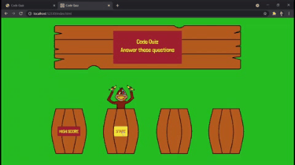

# Code Quiz

https://wijeremy.github.io/code-quiz/

## Introduction

For this project, I was tasked with creating a JavaScript quiz game that would meet the following criteria:

* Clicking a start button should start the game.
* The game should comprise of successive questions with multitple choice answers.
* The game should be timed.
* Answering a question wrong should result in a time penalty.
* When all the questions are answered or the timer runs out the game should end.
* When the game ends, the player should be able to save their high score.

Straight forward engouh, right? Well of course I couldn't make it that easy on myself. And so I present to you "Cyber Monkeys"! The game "Cyber Monkeys" should also meet the following criteria:

* When an answer is clicked, a cyber monkey should pop out of the barrel with the correct answer, regardless of which barrel is clicked.
* When a game is started, a regular monkey pops out of a barrel to explain how to play, what a cyber monkey is, and why they're after your bananium rods.

This didn't prove to be too big of problem. But we'll get into that more later. Suffice to say, it was finiky enough that I only finished the first criterium on launch. 

On launch the game looked something like this:

 

Ultimately, I broke down this build into the following steps:

* Get the game to work without a high score board.
* Get the game to look like "Cyber Monkey".
* Incorporate the high score board.

<p>&nbsp;</p>

## A Functioning Code Quiz
I had a week to get this project done, and I finished this part fairly early. I say finished like it was completely bug free and never needed to be touched on again, which is simply not the case. I'll get more into it later, but adding sprites threw a huge monkey wrench into this (pun intended). I had a lot of fun with this part of the build though. I developed a couple new functions that were quite useful. I also got a chance to incorporate some functions from previous builds. Much of the code that makes the game run can be broken down like this:

* jsQuestions: An array of questions and answers.
    * Correct answers should be labled as such in this array.
* runGame(): a function that governs much of how the game runs, mostly to do with the question and answer aspects of the game.
    * It is excecuted by an on click event listener tied to the start button.
    * Remove intro text, start button, and high score button.
    * Create four buttons at the bottom of the screen.
    * Those four buttons will be given the following on click event listener (checkTrue()):
        * When a button is clicked, the game will check if that answer has been labled as correct.
        * If it's correct, display the next question and answers immediately.
        * If it's incorrect, wait 10 seconds and then display the next question.  
    * Initialize the questionDisplay() function:
        * A question will be fed into the jumbotron.
        * Its answers will be fed into the buttons.
        * The veracity of the answer should be added at a data attribute to that button.
        * The questions should be in a random order.
        * The answers should be in a random order.
        * Each time a question is used, we will tick up on the currentQuestion variable (which starts at 0).
        * When currentQuestion is equal to the lenght of jsQuestions (or one past the final index of that array), we are out of questions, so end the game.
* A simple timer is also included which will end the game if it reaches 0.

All of this was fairly straight forward. It was a lot of moving parts, but let me go through them.

### jsQuestions
Each index of jsQuestions contains its own question/answer array, which looked something like this:

```JavaScript
var jsQuestions = [
    //An array formatted exactly like this is at each index of jsQuestions
    //I will call this index "n" for this example
    [
        //jsQuestions[n][0] is always a question
        "Here is a question?",
        //jsQuestions[n][1] is always yet another array, containing possible answers.
        //Let's say that jsQuestions[n][1] is a variable called "answer"
        [   
            //Let's generalize the position of each index of answer as "i"
            //You can see that answer[i][0] contains a possible answer
            //Likewise, answer[i][1] contains its "veracity", denoted by true or false 
            ["answer 1", true],
            ["answer 2", false],
            ["answer 3", false],
            ["answer 4", false]
        ]
    ]
    //... etc.
]
```

This formatting was reasonably flexible, and I had hopes of throwing in other question types besides four answer multiple choice, such as true false questions. However, I decided to stick to the simple in order to get everything done on time. This was also rather bulky and took up a great deal of space in my JavaScript, but it had to go somewhere, and formatting it as an array meant js was the best place for it. 

### runGame()
This first part of this function is basically house keeping. The home screen gets wiped away. The timer gets started and displayed. We set some variables we'll need. We also use the shuffle array function I made for my [secure password generator](https://github.com/wijeremy/Secure-Password-Generator) to randomize the order we'll display jsQuestions in. 

Another big thing that happens is, once all the buttons are in place, we give them an on click event listener to run the checkTrue() function. But before we get into that, I also want to mention this is done in a function named btnOn(). We also make a sister function btnOff() that can remove those event listeners later. This way, we have control over when the buttons are on and off durring certain events in the game.

Before I describe the checkTrue() function, it will be helpful to go over the questionDisplay() function. It basically reads like the notes I put in the above js of the jsQuestions mock up. First we see if the variable currentQuestions equals the length of the array we want to pull questions out of, because if it does, then we've gone though all the questions and we should end the game. Assuming that doesn't happen, we go to the index equal to currenQuestion of our question bank (which, by the way, is a new array named listShuffled which is what we set our shuffleArray(jsQuestions) equal to). That is to say, if currentQuestion was equal to n (we were on the (n+1)th question), we would go to index n of our question bank (listShuffled). Then we take the question part of that index (listShuffled[n][0]) and display it in the jumbotron. Then we iterate through the answer part of that index (listShuffled[n][1]). For each answer in that array, we put the text half as the text content of the button, and use setAttribute() to set an attribute named "data-key" to the value of the "veracity" half of that answer.

This is what the checkTrue() function is looking for. Whenever a button is clicked, if that button's "data-key" attribute is "true", the game knows you got a correct answer, and will simply move on to the next question. If the button's "data-key" is "false", then the game will pause for 10 seconds. (Eventually we will add a way for you to know which answer is correct, but that is coming up in the next section). 

### Timer Element
The timer is a basic timer. I'll just put its js up here for you:

```JavaScript
function setTime() {
        var timerInterval = setInterval(function() {
            frameRate--;
            if (frameRate == 0) {
                frameRate = frameRateInit 
                secondsLeft--;
                timeEl.textContent = secondsLeft + " seconds left.";
                if (isWin) {
                    clearInterval(timerInterval);
                };  
                if(secondsLeft === 0){
                    clearInterval(timerInterval);
                    question.textContent = "YOU LOSE"
                    remove(monkey);
                    btnOff()
                    init();
                };
            }
        }, 1000/frameRate);
    };
```

The first thing I'd like to point out was possibly the first but certainly not the last example of over solving a problem. I'm sure there is a more elegant way of handling it, but I incorporated a way to boost the "framerate" of the timer. I was frustrated getting to the end of a quiz only to have the game take a second off the clock after the game was over. I realize now that I could have it only take time off the clock if the game was still going, but I wanted to see how this could work. Basically, there is a countdown inside the timer for the framerate. It's like telling the function "what would you like to count to every second, and every time you count to that number tell me a second has gone by". A little convoluted maybe, but it was interesting to see the second argument in the setInterval() function take a variable. 

And what does the function "remove(monkey)" do, you might ask? Well let me tell you.

<p>&nbsp;</p>

## Cyber Monkey!
Let's face it, tests are boring. You know what's not boring? Monkeys. You know what's even cooler than monkeys? Monkeys with laser eyes. 

So pretty early on, I had this crazy idea of making this quiz into a full on video game. I thought maybe I could do a space invaders kind of thing where you'd have to shoot the answers out of the sky, but that seemed hard to implement on mobile. Ultimately, I settled for the idea that it would just be a normal quiz format -- a big box up top with the question and little buttons down bellow for the answers. But I wanted to have fun with it, so I created this silly story to explain what was going on:

    In the distant future, monkeys have learned to harness the power of bananium to power their technologically advanced society. Knowing how valuable this resource is, the elders store the bananium in a series of puzzles so that only those with the knowledge of JavaScript can access them. Unfortunately, in the way even more distant future, bananium has become scarce. This has lead to cyber monkeys being sent back in time to collect our bananium. And what’s more, their laser eyes can detect bananium and have foiled our elder’s puzzles. The evil cyber monkeys have raided our stash of bananium once more. It’s up to you to catch them before they steal all out bananium. But watch out: you only get one shot per puzzle. If you search the wrong barrel on accident, the cyber monkeys will get the jump on you and use their dreaded time-stun gun on you while they clear out that puzzle’s stash of bananium. Good luck, JavaScript warrior. Our society is counting on you!

I figured if I couldn't make the gameplay that exciting, I could at least give it a good story. Unfortunately, the due date of this project is drawing close, and I don't think I'll have time to implement a story element to this game. 

But I still got the monkeys and stuff to work. I drew everything in microsoft paint. Getting everything placed was a bit of a trick, but setting evertying to the unit vh basically saved my bacon in that respect. I also tried tying the event listeners to the actual elements of the barrels and what were at the time header tags instead of buttons. That went away after I learned bootstrap in a recent class and felt that making them buttons would just look much cleaner. 

Choosing to style everything this way also created a problem that gave me a headache for quite some time. Now that all the buttons and such were in static places, I decided it would be better to just write the buttons into the html and have them be there all the time and maybe hide them (set display to none) if I didn't want them there, but to not actually remove any elements. Well, making sure the event listeners for the start button and the high score buttons were removed turned out to be more of a trick than I had thought they would be. I don't remember why that gave me so much trouble, but I think the worst part about it was for a while I didn't even realize it was a problem and was wondering why my timer was going a million ticks a seconds and my buttons were acting weird. 

There was also a new problem of making the monkeys show up and leave when I wanted. To make it easier on myself I wanted to give the monkey an id every time it was made so I could grab it again when I needed to. This, however, meant that every single time a monkey was made or removed had to be accounted for. There could be no double monkeys or ids would get weird and not work. This should have been simple, but I kept flip flopping on when I wanted to make the monkey that double monkeys would slip in. What's more is how hard this was to trouble shoot because the monkeys came in hidden behind a barrel. If they didn't the game would break because the player would have all the answers. 

I could sit here and try to list every way this was difficult, but in short it was just a huge headache and ended up taking almost half the time I spent working on this project just chasing monkeys around. 


<p>&nbsp;</p>

## High Score 

This part was so cool. I went in thinking it would be a cakewalk and it totally got me good. But I got to write so many fun and new functions that I'm sure I'll use again. They were written quite narrowly for this specific assignment, but I'm sure they could be adjusted for something else.

First off, I want to point out that I chose to make a new html page just for the score board. To do this and have my js not freak out, I decided to have a second page of js just for this page. I don't know if this is the correct way to do things -- it gave me worries sometimes, but everything ended up working out how I wanted.

So I know there are built in ways to sort things, but they didn't really suit my needs. I didn't want to sort raw values inside an array; instead I wanted to sort a series of arrays by what value they had at a specific index. To explain, let me show you my filler array "scoreBoard".

```JavaScript
var scoreBoard = [
    ["ver", 3],
    ["abc", 20],
    ["xxd", 18],
    ["qwe", 17],
    ["jys", 16],
    ["sdf", 15],
    ["nfw", 14],
    ["nrt", 7],
    ["gbu", 12],
    ["foo", 11],
]
```

This is the format we're working with. I'll get more into how it works with local storage in a second. However, look at scoreBoard[0]. We have ["ver", 3]. This is representing someone with initials "ver" getting a score of 3. Now we want to take every index of scoreBoard and stort them by the value they have at index 1. That is, for example, ["ver", 3] should be moved to the last item in out list. 

I solved this with a neat little function sortArray[]:

```JavaScript
function sortArray(array) {
    //Let's make variables
    var newArray = [];
    var tempScore = [];
    //We move through every index of the array, one by one
    for (var i=0; i < array.length; i++) {
        //If we haven't put anything in our new dummy array
        if (newArray.length == 0){
            //And we need to push a dummy array named tempScore
            tempScore = [];
            //That will be the same as the array at index i of our array
            tempScore.push(array[i][0]);
            //Except we want to make sure we parse the second half of that array as an integer
            //This shouldn't really be necessary and in fact this function won't work unless
            //that value is already an integer, but I'm paranoid, and at least this function will 
            //make sure those values are something we can work with in the future.
            tempScore.push(parseInt(array[i][1]));
            //And then since this is the first thing we're putting in, we just put it in.
            newArray.push(tempScore);
        }else {
            //Now we know there's something in our new dummy aray we can compare our current score to
            //So we go through every value in our new dummy array and
            for (var j=0; j < newArray.length; j++) {
                //if our score is equal to or better than that score 
                //(It's worth pointing out that there has to be a decision made about how
                //to break ties, and this is where I made that decision. It was completely
                //arbitrary.)
                if (array[i][1] >= newArray[j][1]) {
                    //we jump through our hoops to make sure everything stays a number
                    tempScore = [];
                    tempScore.push(array[i][0]);
                    tempScore.push(parseInt(array[i][1]));
                    //and put our score in front of that dumb old score
                    //(again, arbitrary)
                    newArray.splice(j,0,tempScore);
                    //and then we STOP because we don't want to put the same score in more than once
                    break;
                //But what if we get to the end of our new dummy array and the score we're trying to bring over from our unsorted list isn't better than any of them?
                } else if (j == newArray.length - 1) {
                    tempScore = [];
                    tempScore.push(array[i][0]);
                    tempScore.push(parseInt(array[i][1]));
                    //Then we just put it at the end.
                    newArray.push(tempScore);
                    break;
                }
            };
        };
    };
    //When that process is all done, we should have gone through each item in our unsortd array
    // and put them into our sorted newArray; so we return that as our final product.
    return newArray;
};
```
And that entire function is completely useless. Because I could have just typed scoreBoard in the order I wanted, and this function only ever gets called to order that function. This is because the rest of the function will naturally sort our scoreboard. So let's look at those too.

```JavaScript
function newHighScore(score, board) {
    var tempScore = [];
    for (var i = 0; i < board.length; i++) {
        if (score[1] >= board[i][1]) {
            tempScore = []
            tempScore.push(board[i][0]);
            tempScore.push(parseInt(board[i][1]));
            board.pop();
            board.splice(i,0,score);
            break;
        };
    };
    return board;
};

function setNewHighScore() {
    if (isWin == "true") {
        var tempScore = []
        var tempBoard = []
        tempScore = JSON.parse(score)
        tempBoard = JSON.parse(localBoard)
        var newBoard = newHighScore(tempScore, tempBoard);
        localStorage.setItem("board", JSON.stringify(newBoard));
        localStorage.setItem("isWin", false)
        location.reload();
    };
};
setNewHighScore();
```

In short, newHighScore() takes on the logic to take a score, go through an array, and push that score into an array in a positions it is ranked for (this also includes removing the lowest score from the previous score board). setNewHighScore, on the other hand, takes on the responsibilities for watching out for when a new high score is posted, grabbing the old score board from local storage, the score from local storage, JSON.pars-ing them into something we can work with, running newHighScore on both, and then JSON.scringify-ing the result and saving it back to local storage. 

One more function we run on every load is actually rendering the score board we have saved in local storage:

```JavaScript
function renderBoard(array) {
    var tempArray = JSON.parse(array)
    for (var i = 0; i < tempArray.length; i++) {
        var nameSlot = document.getElementById("board").children[1].children[i].children[1]
        var scoreSlot = document.getElementById("board").children[1].children[i].children[2]
        var name = tempArray[i][0]
        var score = tempArray[i][1]
        nameSlot.textContent = name;
        scoreSlot.textContent = score;
    };
};
```

## Conclusion

This was a fun excitement. I bit off more than I could chew, and wasted a lot of time chasing monkeys. However, I learned a lot from it and developed some cool code. I hope to fully realize Cyber Monkeys in the future, but for now, a groovy js quiz game with a creepy monkey robot mascot is good enough for me.


<style>

    h2 {
        background-color: brown;
        color: yellow;
    }

    h3 {
        color: yellow;
    }

</style>